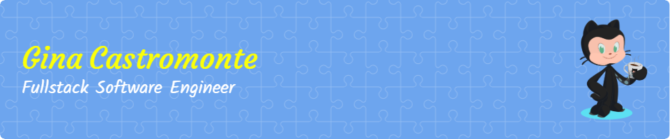

📧 Email: gcastromonte@gmail.com

👯 Connect: https://www.linkedin.com/in/ginacastromonte/

📁 Check out my Portfolio Website 🌐: https://www.gcastromonte.com

🏃🏻‍♀️ Fun fact: After many years of being a dog whisperer, I now get to be a code whisperer!

## 🧰 Languages and Tools:

🤝 Let’s Connect

I’m always open to collaborating, mentoring, or just talking about ideas.

Reach out if you want to collaborate, share ideas, or build something impactful together.
